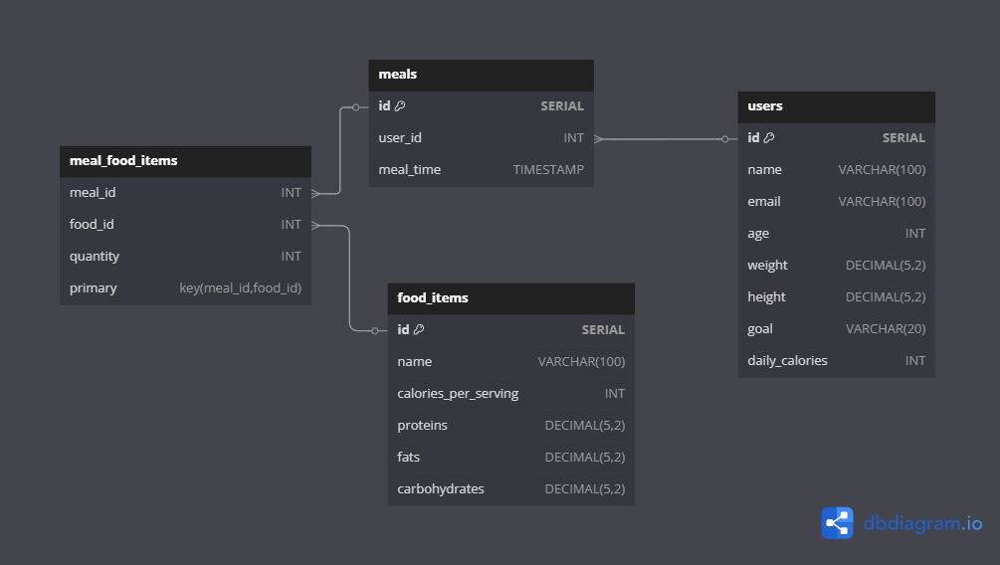

# 🥗 Calorie Tracker

Calorie Tracker — это удобное приложение для отслеживания калорийности потребляемых
продуктов и ведения здорового образа жизни.

# 🔧 Стек технологий

Java 21 + Spring Boot (REST API)

PostgreSQL (основная БД)

Docker & Docker Compose (для контейнеризации)

MapStruct (для маппинга DTO)

Lombok (для удобства кода)

JUnit + Mockito (для тестирования)

# 🚀 Функциональные возможности

### 🔹 Управление продуктами

✔ Добавление нового продукта (название, калории, белки, жиры, углеводы)

✔ Получение информации о продукте по ID

✔ Просмотр списка всех продуктов

✔ Обновление данных о продукте

✔ Удаление продуктов

### 🔹 Учёт приёмов пищи

✔ Добавление нового приёма пищи с продуктами

✔ Просмотр всех приёмов пищи за день

✔ Удаление приёма пищи

### 🔹 Расчет потребления калорий

✔ Подсчет общей калорийности за день

✔ Подсчет суточного потребления белков, жиров и углеводов

### 🔹 Пользователи

✔ Регистрация и аутентификация пользователей

✔ Получение информации о пользователе

✔ Управление настройками пользователя

# 🛠 Установка и запуск

### Клонируй репозиторий:
```sh
git clone https://github.com/killerop16/calorie-tracker.git
```
```sh
cd calorie-tracker
```
### Запусти сборку проекта:
```sh
mvn clean install
```
### Запусти контейнеры:
```sh
docker-compose up -d
```

## 📊 Схема базы данных

Вот схема базы данных проекта:


